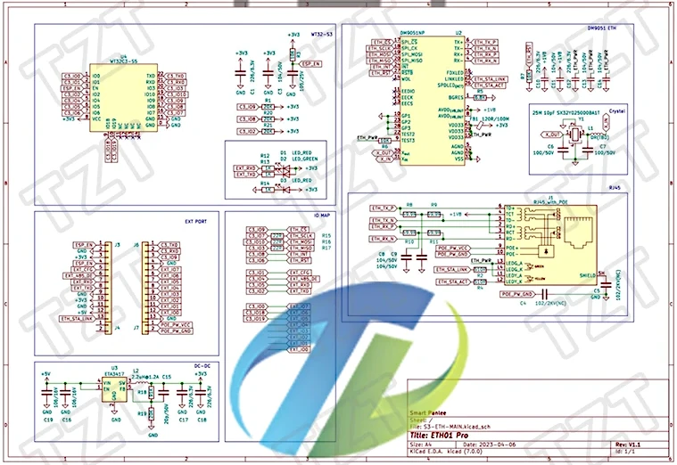
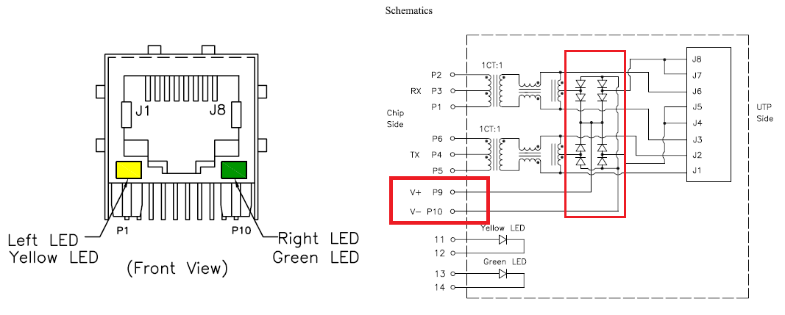

### eth01-evo board

### Pinout

| # | left | desc |
|-|-|-|
| 1  | POE- |        |
| 2  | POE+ |        |
| 3  | GND  |        |
| 4  | NC   |        |
| 5  | NC   |        |
| 6  | NC   |        |
| 7  | NC   |        |
| 8  | NC   |        |
| 9  | IO19 | USB D+ |
| 10 | IO18 | USB D- |
| 11 | IO00 | GPIO0  |
| 12 | GND  |        |
| 13 | IO09 | GPIO9  | ETH_CS -> 20k -> 3v3
| 14 | RXD0 | GPIO20 |
| 15 | TXD0 | GPIO21 |
| 16 | EN   |        |
| 17 | GND  |        |
| 18 | 3v3  |        |
| 19 | EN   |        |
| 20 | IO01 | GPIO1  |
| 21 | IO04 | GPIO4  |
| 22 | IO05 | GPIO5  | 1k -> LED -> 3v3
| 23 | IO02 | GPIO2  | 1k -> LED -> 3v3
| 24 | GND  |        |
| 25 | 3V3  |        |
| 26 | GND  |        |
| 27 | 5V   |        |
| 28 | LINK |        |
| 29 | NC   |        |
| 30 | NC   |        |

### DC-DC

ETA3417 : https://datasheet.lcsc.com/lcsc/2307171444_etasolution-ETA3417S2F_C7465507.pdf

### DM9051

Davicom DM9051 SPI Ethernet Controller

https://www.dacomwest.de/en/?view=article&id=207:dm9051-en

https://www.dacomwest.de/en/component/edocman/dm9051-i-12-mco-ds-p01-03302015/download

| DM9051 | signal   | esp32 |
|--------|----------|-------|
| 17     | SPI_CN   | IO9   | -> 20k -> 3v3
| 18     | SPI_CLK  | IO7   |
| 19     | SPI_MOSI | IO10  |
| 10     | SPI_MISO | IO3   |
| 24     | INT      | IO8   | -> 20k -> 3v3
| 27     | RSTB     | IO6   |

### Ethernet Driver

https://docs.espressif.com/projects/esp-idf/en/latest/esp32c3/api-reference/network/esp_eth.html#spi-ethernet-module

### RJ45 connector

https://pcbartists.com/design/embedded/esp32-passive-poe-power-over-ethernet-design-schematic

### WT32C3-S5 module

http://en.wireless-tag.com/product-item-18.html

https://img01.71360.com/file/read/www2/M00/6A/08/rBwBEmSBkI6AUYJDABeEbPVIioE463.pdf?dl=1&dlf=WT32C3-S5+Datasheet+V1.0.3.pdf

https://templates.blakadder.com/wireless_tag_WT32C3-S5.html

### ESP32-C3 MCU

https://www.espressif.com/sites/default/files/documentation/esp32-c3_datasheet_en.pdf

https://docs.espressif.com/projects/esp-idf/en/latest/esp32c3/

https://docs.espressif.com/projects/esp-idf/en/latest/esp32c3/get-started/establish-serial-connection.html

### Other

https://github.com/esphome/feature-requests/issues/2427
