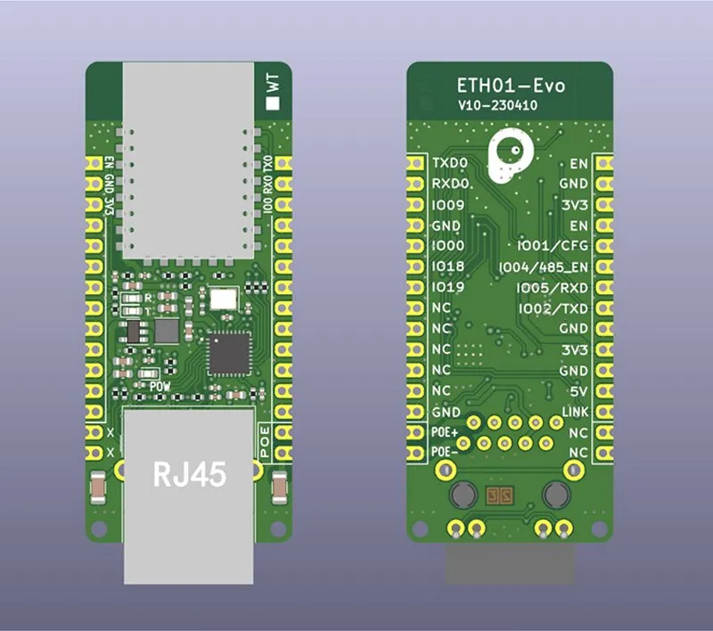
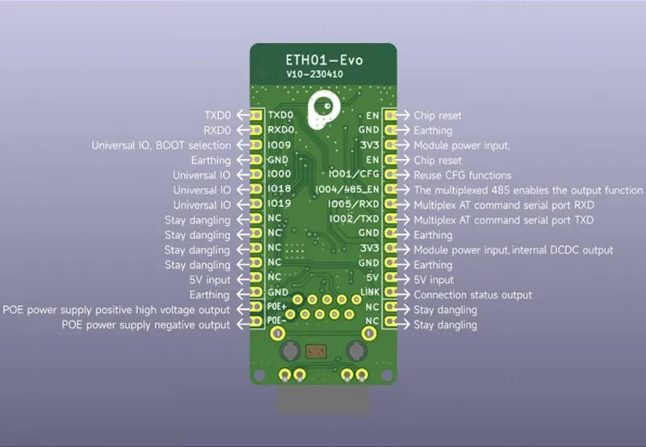
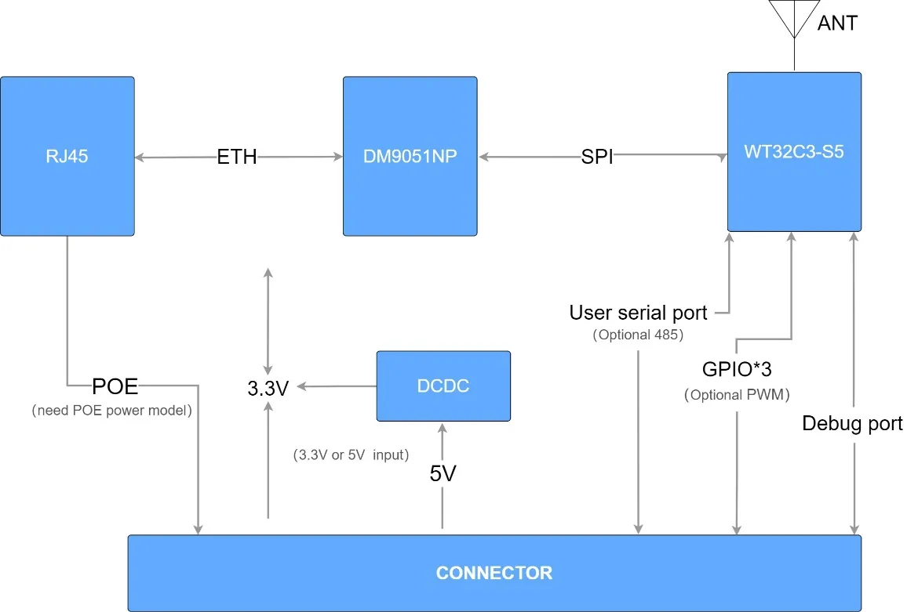

### eth01-evo board

### DM9051

Davicom DM9051 SPI Ethernet Controller

https://www.dacomwest.de/en/?view=article&id=207:dm9051-en

https://www.dacomwest.de/en/component/edocman/dm9051-i-12-mco-ds-p01-03302015/download

### Ethernet Driver

https://docs.espressif.com/projects/esp-idf/en/latest/esp32c3/api-reference/network/esp_eth.html#spi-ethernet-module

### WT32C3-S5 module

http://en.wireless-tag.com/product-item-18.html

https://img01.71360.com/file/read/www2/M00/6A/08/rBwBEmSBkI6AUYJDABeEbPVIioE463.pdf?dl=1&dlf=WT32C3-S5+Datasheet+V1.0.3.pdf

https://templates.blakadder.com/wireless_tag_WT32C3-S5.html

### ESP32-C3 MCU

https://www.espressif.com/sites/default/files/documentation/esp32-c3_datasheet_en.pdf

https://docs.espressif.com/projects/esp-idf/en/latest/esp32c3/

### Other

https://github.com/esphome/feature-requests/issues/2427
